# TỔNG HỢP TOÀN BỘ SƠ ĐỒ VÀ MÔ TẢ CHO BÁO CÁO ĐỒ ÁN
## HỆ THỐNG HỌC TẬP & ĐẤU TRƯỜNG VẬT LÝ EUREKA (EUREKA PHYSICS PLATFORM)

---

## 📚 MỤC LỤC BÁO CÁO

- [CHƯƠNG 1: TỔNG QUAN & YÊU CẦU](#chương-1-tổng-quan--yêu-cầu)
  - [1. Sơ đồ Cấu trúc Chức năng (FDD - Functional Decomposition Diagram)](#1-sơ-đồ-cấu-trúc-chức-năng-fdd---functional-decomposition-diagram)
  - [2. Sơ đồ Use Case Tổng quan & Chi tiết cho 4 Tác nhân (Use Case Diagrams)](#2-sơ-đồ-use-case-tổng-quan--chi-tiết-cho-4-tác-nhân-use-case-diagrams)
    - [2.1 Bảng tả chi tiết 4 Tác nhân (Actors)](#21-bảng-tả-chi-tiết-4-tác-nhân-actors)
    - [2.2 Bản tả chi tiết 29 Chức năng (Use Cases)](#22-bản-tả-chi-tiết-29-chức-năng-use-cases)
    - [2.3 Mã Mermaid cho 4 Sơ đồ Use Case phân rã từng Actor](#23-mã-mermaid-cho-4-sơ-đồ-use-case-phân-rã-từng-actor)
- [CHƯƠNG 2: THIẾT KẾ KIẾN TRÚC & DỮ LIỆU](#chương-2-thiết-kế-kiến-trúc--dữ-liệu)
  - [3. Sơ đồ Kiến trúc Hệ thống (System Architecture Diagram)](#3-sơ-đồ-kiến-trúc-hệ-thống-system-architecture-diagram)
  - [4. Sơ đồ Cơ sở Dữ liệu ERD 20 Bảng (Entity Relationship Diagram)](#4-sơ-đồ-cơ-sở-dữ-liệu-erd-20-bảng-entity-relationship-diagram)
- [CHƯƠNG 3: THIẾT KẾ CHI TIẾT & TRÌNH TỰ](#chương-3-thiết-kế-chi-tiết--trình-tự)
  - [5. Sơ đồ Trình tự (Sequence Diagrams cho 4 Luồng chính)](#5-sơ-đồ-trình-tự-sequence-diagrams-cho-4-luồng-chính)

---

# CHƯƠNG 1: TỔNG QUAN & YÊU CẦU

## 1. Sơ đồ Cấu trúc Chức năng (FDD - Functional Decomposition Diagram)

### Mã Mermaid FDD (Dán vào Draw.io -> + -> Advanced -> Mermaid...):

```mermaid
graph TD
    Root[EUREKA PHYSICS LEARNING & PK ARENA SYSTEM]
    
    Sub1[1. Authentication & Account Management]
    Sub2[2. Interactive Lectures & Learning]
    Sub3[3. Virtual Physics Laboratory]
    Sub4[4. Physics Utilities & Tools]
    Sub5[5. PK Battle Arena & Games]
    Sub6[6. Support & Real-Time Messaging]
    Sub7[7. Teacher Management Panel]
    Sub8[8. System Administration Panel]

    Root --> Sub1
    Root --> Sub2
    Root --> Sub3
    Root --> Sub4
    Root --> Sub5
    Root --> Sub6
    Root --> Sub7
    Root --> Sub8

    Sub1 --> F11[1.1 User Registration & Login]
    Sub1 --> F12[1.2 Profile & Avatar Management]
    Sub1 --> F13[1.3 Teacher Role Application]

    Sub2 --> F21[2.1 Interactive Theory & Lessons]
    Sub2 --> F22[2.2 Placement Test & Assessment]
    Sub2 --> F23[2.3 Student Class Management]

    Sub3 --> F31[3.1 Mechanics & Dynamics Experiments]
    Sub3 --> F32[3.2 Electromagnetism Experiments]
    Sub3 --> F33[3.3 Optics & Waves Experiments]
    Sub3 --> F34[3.4 Thermodynamics Experiments]

    Sub4 --> F41[4.1 Scientific Physics Calculator]
    Sub4 --> F42[4.2 Physical Constants Reference]
    Sub4 --> F43[4.3 Unit Converter Utility]

    Sub5 --> F51[5.1 Real-Time PK Battle Matchmaking]
    Sub5 --> F52[5.2 Physics Challenge Games]
    Sub5 --> F53[5.3 XP Leaderboard & Rankings]

    Sub6 --> F61[6.1 User Guide & FAQ Reference]
    Sub6 --> F62[6.2 Real-Time Admin Support Chat]

    Sub7 --> F71[7.1 Teacher Overview Dashboard]
    Sub7 --> F72[7.2 Class & Student Roster Management]
    Sub7 --> F73[7.3 Teaching Materials Library]

    Sub8 --> F81[8.1 System Analytics Dashboard]
    Sub8 --> F82[8.2 User & Teacher Application Approval]
    Sub8 --> F83[8.3 Lessons & Materials Content Management]
    Sub8 --> F84[8.4 Support Tickets & Feedback Resolution]
    Sub8 --> F85[8.5 System Settings & Maintenance Mode]
```

---

## 2. Sơ đồ Use Case Tổng quan & Chi tiết cho 4 Tác nhân (Use Case Diagrams)

### 2.1 Bảng tả chi tiết 4 Tác nhân (Actors)

| STT | Tác nhân (Actor) | Vai trò & Mô tả chi tiết | Quyền hạn trong Hệ thống |
| :---: | :--- | :--- | :--- |
| 1 | **Guest** (Khách vãng lai) | Người dùng chưa đăng nhập. | Xem trang chủ, giới thiệu, User Guide, FAQ, Privacy Policy. |
| 2 | **Student** (Học sinh) | Học sinh đã đăng ký/đăng nhập. | Học bài giảng, làm test, làm Virtual Lab, dùng Physics Tools, thi đấu PK, xem Leaderboard, chat hỗ trợ. |
| 3 | **Teacher** (Giáo viên) | Giáo viên đã được Admin phê duyệt. | Quản lý lớp học, quản lý học sinh theo lớp, khai thác kho học liệu, gửi hỗ trợ cho Admin. |
| 4 | **Admin** (Quản trị viên) | Quản trị viên hệ thống. | Thống kê Dashboard, duyệt hồ sơ Giáo viên, quản lý người dùng, bài học, học liệu, trả lời hỗ trợ, cấu hình bảo trì. |

---

### 2.2 Bản tả chi tiết 29 Chức năng (Use Cases)

- **UC01: Register Account**: Đăng ký tài khoản mới bằng Email, Mật khẩu, Họ tên.
- **UC02: Login / Logout**: Đăng nhập/Đăng xuất hệ thống an toàn.
- **UC03: Manage Profile & Avatar**: Chỉnh sửa profile, avatar, đổi mật khẩu.
- **UC04: Apply for Teacher Role**: Nộp hồ sơ xin xét duyệt quyền Giáo viên.
- **UC05: View Grade Lectures**: Xem bài giảng phân loại từ Lớp 7 đến 12.
- **UC06: Study Interactive Lesson Content**: Học bài giảng lý thuyết & tóm tắt.
- **UC07: Take Placement Assessment Test**: Làm test đánh giá năng lực đầu vào.
- **UC08: View Enrolled Classes**: Xem danh sách lớp học cá nhân.
- **UC09: Access Virtual Lab Hub**: Truy cập danh mục thí nghiệm ảo.
- **UC10: Perform Virtual Experiments**: Thực hành thí nghiệm mô phỏng trên HTML5 Canvas.
- **UC11: Use Physics Calculator**: Máy tính Vật lý tính toán công thức.
- **UC12: Lookup Physical Constants**: Tra cứu bảng hằng số Vật lý chuẩn.
- **UC13: Convert Physical Units**: Quy đổi các đơn vị đo lường Vật lý.
- **UC14: Matchmaking Lobby**: Sảnh ghép trận đấu trường PK tự động.
- **UC15: PK Battle & Results**: Thi đấu PK Real-time & hiển thị kết quả.
- **UC16: Play Balance Challenge Game**: Game thử thách cân bằng lực.
- **UC17: View XP Leaderboard**: Bảng xếp hạng vinh danh Top XP.
- **UC18: Read User Guide & FAQ**: Tra cứu hướng dẫn & câu hỏi thường gặp.
- **UC19: Send Support Message**: Gửi tin nhắn hỗ trợ tới Admin.
- **UC20: Manage Teacher Classes**: Giáo viên tạo và quản lý lớp học.
- **UC21: Browse Learning Materials**: Giáo viên khai thác kho tài nguyên học liệu.
- **UC22: Send Teacher Support Ticket**: Yêu cầu hỗ trợ dành riêng cho Giáo viên.
- **UC23: Admin Login**: Đăng nhập trang quản trị Admin.
- **UC24: View System Analytics Dashboard**: Thống kê chỉ số người dùng & hệ thống.
- **UC25: Approve Teachers & Manage Users**: Quản lý tài khoản & Duyệt đơn Giáo viên.
- **UC26: Manage Lessons Content**: Thêm, sửa, xóa nội dung Bài giảng.
- **UC27: Manage Materials Resources**: Quản lý kho Học liệu & đề thi.
- **UC28: Resolve Support Messages**: Trả lời tin nhắn hỗ trợ Real-time.
- **UC29: Maintenance & System Settings**: Cấu hình trang & Bật/Tắt chế độ bảo trì.

---

### 2.3 Sơ đồ Use Case Tổng quan Hệ thống (Giữ khung thiết kế chuẩn mẫu & Đầy đủ 29 Use Cases)

Sơ đồ dưới đây **giữ nguyên 100% khung thiết kế gốc bạn yêu cầu** (Khối Client Actors bên trái có quan hệ *Kế thừa*, Khối Administrator góc trên bên phải, 3 Cụm Subsystem ở giữa, các liên kết *include*) nhưng đã được **BỔ SUNG ĐẦY ĐỦ TRỌN VẸN 29 USE CASES (UC01 ➔ UC29)**.

#### 🎨 MÃ MERMAID CHUẨN KHUNG NỔI BẬT (DÁN VÀO DRAW.IO)

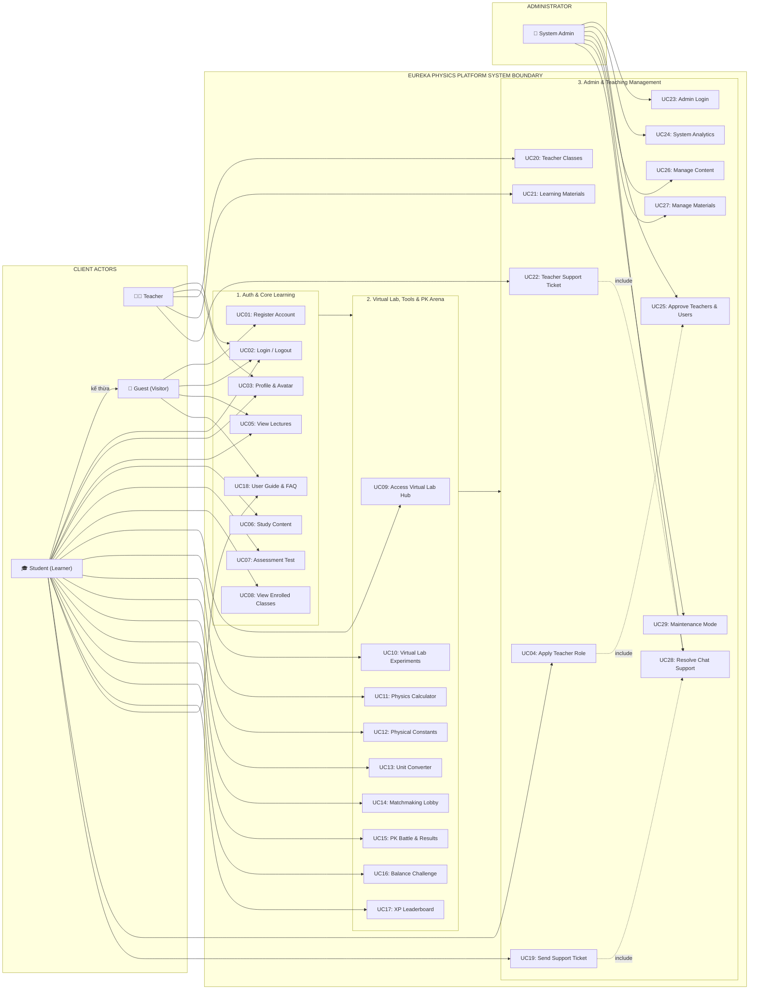
```mermaid
graph LR
    direction LR

    %% 1. CLIENT ACTORS (LEFT BOX)
    subgraph ClientActors ["CLIENT ACTORS"]
        direction TB
        Teacher["👨‍🏫 Teacher"]
        Student["🎓 Student (Learner)"]
        Guest["👤 Guest (Visitor)"]
        
        %% Generalization / Inheritance
        Student -- "kế thừa" --> Guest
    end

    %% 2. SYSTEM BOUNDARY (MIDDLE BOX WITH 3 SUBSYSTEMS)
    subgraph SystemBoundary ["EUREKA PHYSICS PLATFORM SYSTEM BOUNDARY"]
        direction LR

        %% Subsystem 1: Auth & Core Learning (UC01-UC03, UC05-UC08, UC18)
        subgraph Sub1 ["1. Auth & Core Learning"]
            direction TB
            UC01["UC01: Register Account"]
            UC02["UC02: Login / Logout"]
            UC03["UC03: Profile & Avatar"]
            UC05["UC05: View Lectures"]
            UC06["UC06: Study Content"]
            UC07["UC07: Assessment Test"]
            UC08["UC08: View Enrolled Classes"]
            UC18["UC18: User Guide & FAQ"]
        end

        %% Subsystem 2: Virtual Lab, Tools & PK Arena (UC09-UC17)
        subgraph Sub2 ["2. Virtual Lab, Tools & PK Arena"]
            direction TB
            UC09["UC09: Access Virtual Lab Hub"]
            UC10["UC10: Virtual Lab Experiments"]
            UC11["UC11: Physics Calculator"]
            UC12["UC12: Physical Constants"]
            UC13["UC13: Unit Converter"]
            UC14["UC14: Matchmaking Lobby"]
            UC15["UC15: PK Battle & Results"]
            UC16["UC16: Balance Challenge"]
            UC17["UC17: XP Leaderboard"]
        end

        %% Subsystem 3: Admin & Teaching Management (UC04, UC19-UC29)
        subgraph Sub3 ["3. Admin & Teaching Management"]
            direction TB
            UC04["UC04: Apply Teacher Role"]
            UC19["UC19: Send Support Ticket"]
            UC20["UC20: Teacher Classes"]
            UC21["UC21: Learning Materials"]
            UC22["UC22: Teacher Support Ticket"]
            UC23["UC23: Admin Login"]
            UC24["UC24: System Analytics"]
            UC25["UC25: Approve Teachers & Users"]
            UC26["UC26: Manage Content"]
            UC27["UC27: Manage Materials"]
            UC28["UC28: Resolve Chat Support"]
            UC29["UC29: Maintenance Mode"]
        end

        %% Align sub-packages horizontally
        Sub1 ---> Sub2 ---> Sub3
    end

    %% 3. ADMINISTRATOR (RIGHT BOX)
    subgraph AdminActor ["ADMINISTRATOR"]
        direction TB
        Admin["🔑 System Admin"]
    end

    %% GUEST CONNECTIONS
    Guest --> UC01
    Guest --> UC02
    Guest --> UC05
    Guest --> UC18

    %% STUDENT CONNECTIONS
    Student --> UC02
    Student --> UC03
    Student --> UC05
    Student --> UC06
    Student --> UC07
    Student --> UC08
    Student --> UC09
    Student --> UC10
    Student --> UC11
    Student --> UC12
    Student --> UC13
    Student --> UC14
    Student --> UC15
    Student --> UC16
    Student --> UC17
    Student --> UC18
    Student --> UC04
    Student --> UC19

    %% TEACHER CONNECTIONS
    Teacher --> UC02
    Teacher --> UC03
    Teacher --> UC20
    Teacher --> UC21
    Teacher --> UC22

    %% ADMIN CONNECTIONS
    Admin --> UC23
    Admin --> UC24
    Admin --> UC25
    Admin --> UC26
    Admin --> UC27
    Admin --> UC28
    Admin --> UC29

    %% INCLUDE RELATIONSHIPS
    UC04 -. "include" .-> UC25
    UC19 -. "include" .-> UC28
    UC22 -. "include" .-> UC28
```

---

### 2.4 Mã Mermaid cho 4 Sơ đồ Use Case phân rã từng Actor

#### 🎨 Sơ đồ Use Case - GUEST ACTOR
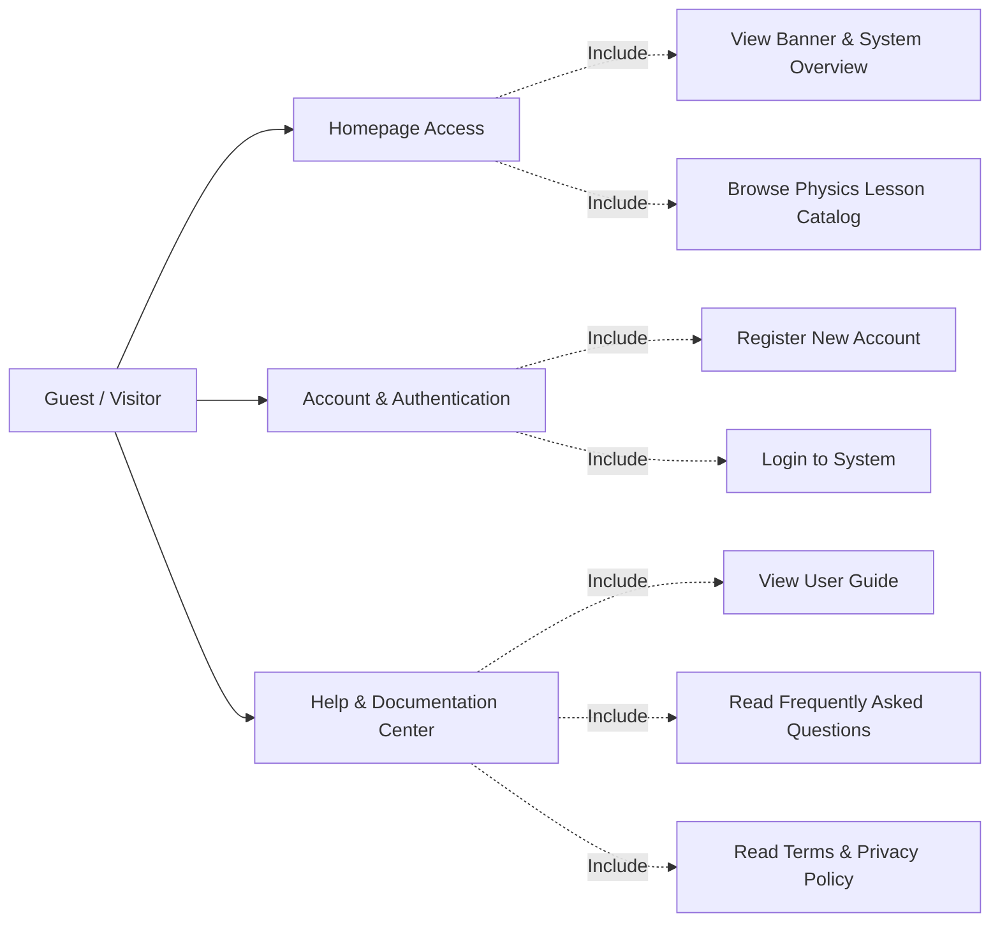
```mermaid
graph LR
    Guest[Guest / Visitor]

    UC1[Homepage Access]
    UC2[Account & Authentication]
    UC3[Help & Documentation Center]

    Guest --> UC1
    Guest --> UC2
    Guest --> UC3

    UC1 -. Include .-> UC1_1[View Banner & System Overview]
    UC1 -. Include .-> UC1_2[Browse Physics Lesson Catalog]

    UC2 -. Include .-> UC2_1[Register New Account]
    UC2 -. Include .-> UC2_2[Login to System]

    UC3 -. Include .-> UC3_1[View User Guide]
    UC3 -. Include .-> UC3_2[Read Frequently Asked Questions]
    UC3 -. Include .-> UC3_3[Read Terms & Privacy Policy]
```

#### 🎨 Sơ đồ Use Case - STUDENT ACTOR
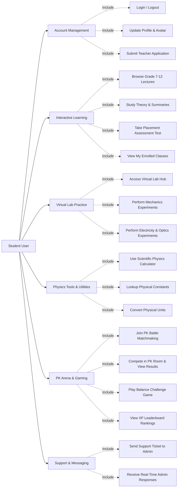
```mermaid
graph LR
    Student[Student User]

    UC1[Account Management]
    UC2[Interactive Learning]
    UC3[Virtual Lab Practice]
    UC4[Physics Tools & Utilities]
    UC5[PK Arena & Gaming]
    UC6[Support & Messaging]

    Student --> UC1
    Student --> UC2
    Student --> UC3
    Student --> UC4
    Student --> UC5
    Student --> UC6

    UC1 -. Include .-> UC1_1[Login / Logout]
    UC1 -. Include .-> UC1_2[Update Profile & Avatar]
    UC1 -. Include .-> UC1_3[Submit Teacher Application]

    UC2 -. Include .-> UC2_1[Browse Grade 7-12 Lectures]
    UC2 -. Include .-> UC2_2[Study Theory & Summaries]
    UC2 -. Include .-> UC2_3[Take Placement Assessment Test]
    UC2 -. Include .-> UC2_4[View My Enrolled Classes]

    UC3 -. Include .-> UC3_1[Access Virtual Lab Hub]
    UC3 -. Include .-> UC3_2[Perform Mechanics Experiments]
    UC3 -. Include .-> UC3_3[Perform Electricity & Optics Experiments]

    UC4 -. Include .-> UC4_1[Use Scientific Physics Calculator]
    UC4 -. Include .-> UC4_2[Lookup Physical Constants]
    UC4 -. Include .-> UC4_3[Convert Physical Units]

    UC5 -. Include .-> UC5_1[Join PK Battle Matchmaking]
    UC5 -. Include .-> UC5_2[Compete in PK Room & View Results]
    UC5 -. Include .-> UC5_3[Play Balance Challenge Game]
    UC5 -. Include .-> UC5_4[View XP Leaderboard Rankings]

    UC6 -. Include .-> UC6_1[Send Support Ticket to Admin]
    UC6 -. Include .-> UC6_2[Receive Real-Time Admin Responses]
```

#### 🎨 Sơ đồ Use Case - TEACHER ACTOR
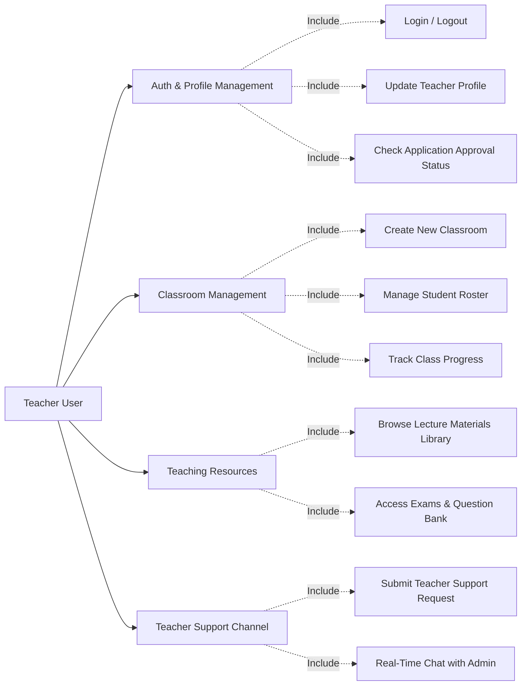
```mermaid
graph LR
    Teacher[Teacher User]

    UC1[Auth & Profile Management]
    UC2[Classroom Management]
    UC3[Teaching Resources]
    UC4[Teacher Support Channel]

    Teacher --> UC1
    Teacher --> UC2
    Teacher --> UC3
    Teacher --> UC4

    UC1 -. Include .-> UC1_1[Login / Logout]
    UC1 -. Include .-> UC1_2[Update Teacher Profile]
    UC1 -. Include .-> UC1_3[Check Application Approval Status]

    UC2 -. Include .-> UC2_1[Create New Classroom]
    UC2 -. Include .-> UC2_2[Manage Student Roster]
    UC2 -. Include .-> UC2_3[Track Class Progress]

    UC3 -. Include .-> UC3_1[Browse Lecture Materials Library]
    UC3 -. Include .-> UC3_2[Access Exams & Question Bank]

    UC4 -. Include .-> UC4_1[Submit Teacher Support Request]
    UC4 -. Include .-> UC4_2[Real-Time Chat with Admin]
```

#### 🎨 Sơ đồ Use Case - ADMIN ACTOR
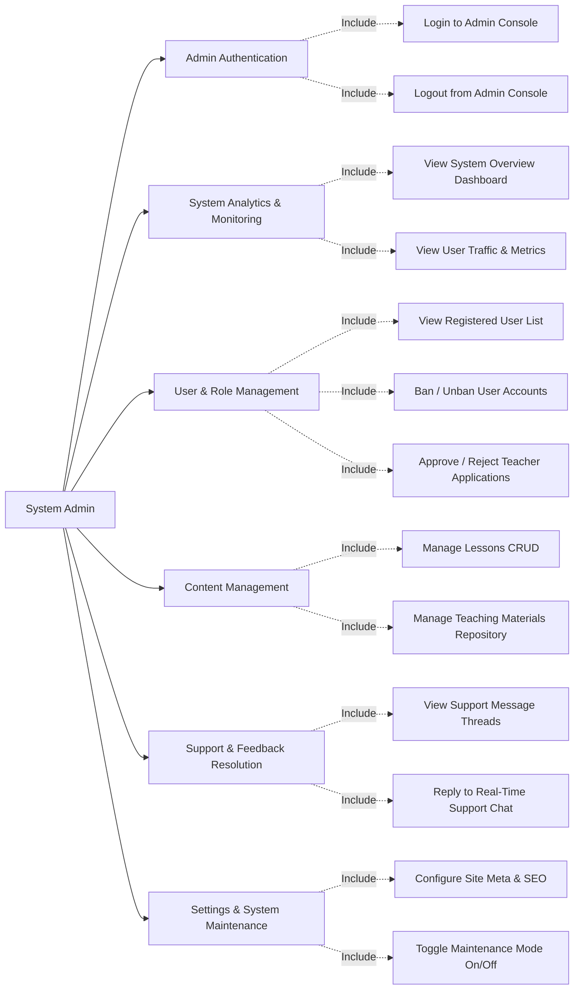
```mermaid
graph LR
    Admin[System Admin]

    UC1[Admin Authentication]
    UC2[System Analytics & Monitoring]
    UC3[User & Role Management]
    UC4[Content Management]
    UC5[Support & Feedback Resolution]
    UC6[Settings & System Maintenance]

    Admin --> UC1
    Admin --> UC2
    Admin --> UC3
    Admin --> UC4
    Admin --> UC5
    Admin --> UC6

    UC1 -. Include .-> UC1_1[Login to Admin Console]
    UC1 -. Include .-> UC1_2[Logout from Admin Console]

    UC2 -. Include .-> UC2_1[View System Overview Dashboard]
    UC2 -. Include .-> UC2_2[View User Traffic & Metrics]

    UC3 -. Include .-> UC3_1[View Registered User List]
    UC3 -. Include .-> UC3_2[Ban / Unban User Accounts]
    UC3 -. Include .-> UC3_3[Approve / Reject Teacher Applications]

    UC4 -. Include .-> UC4_1[Manage Lessons CRUD]
    UC4 -. Include .-> UC4_2[Manage Teaching Materials Repository]

    UC5 -. Include .-> UC5_1[View Support Message Threads]
    UC5 -. Include .-> UC5_2[Reply to Real-Time Support Chat]

    UC6 -. Include .-> UC6_1[Configure Site Meta & SEO]
    UC6 -. Include .-> UC6_2[Toggle Maintenance Mode On/Off]
```

---

# CHƯƠNG 2: THIẾT KẾ KIẾN TRÚC & DỮ LIỆU

## 3. Sơ đồ Kiến trúc Hệ thống (System Architecture Diagram)

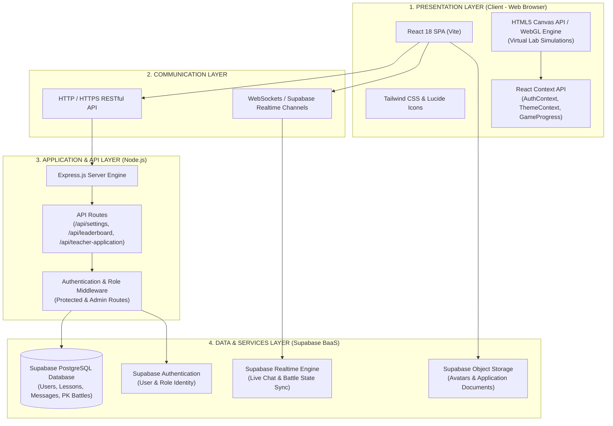
```mermaid
graph TB
    subgraph Client_Layer ["1. PRESENTATION LAYER (Client - Web Browser)"]
        UI["React 18 SPA (Vite)"]
        Styling["Tailwind CSS & Lucide Icons"]
        CanvasEngine["HTML5 Canvas API / WebGL Engine<br/>(Virtual Lab Simulations)"]
        StateMgmt["React Context API<br/>(AuthContext, ThemeContext, GameProgress)"]
    end

    subgraph Transport_Layer ["2. COMMUNICATION LAYER"]
        REST_API["HTTP / HTTPS RESTful API"]
        WS_API["WebSockets / Supabase Realtime Channels"]
    end

    subgraph Backend_Layer ["3. APPLICATION & API LAYER (Node.js)"]
        ExpressApp["Express.js Server Engine"]
        Routes["API Routes<br/>(/api/settings, /api/leaderboard, /api/teacher-application)"]
        AuthMiddleware["Authentication & Role Middleware<br/>(Protected & Admin Routes)"]
    end

    subgraph Database_Layer ["4. DATA & SERVICES LAYER (Supabase BaaS)"]
        SupaAuth["Supabase Authentication<br/>(User & Role Identity)"]
        SupaDB[("Supabase PostgreSQL Database<br/>(Users, Lessons, Messages, PK Battles)")]
        SupaRealtime["Supabase Realtime Engine<br/>(Live Chat & Battle State Sync)"]
        SupaStorage["Supabase Object Storage<br/>(Avatars & Application Documents)"]
    end

    UI --> REST_API
    UI --> WS_API
    CanvasEngine --> StateMgmt

    REST_API --> ExpressApp
    WS_API --> SupaRealtime

    ExpressApp --> Routes
    Routes --> AuthMiddleware
    AuthMiddleware --> SupaDB

    AuthMiddleware --> SupaAuth
    UI --> SupaStorage
```

---

## 4. Sơ đồ Cơ sở Dữ liệu ERD 20 Bảng (Entity Relationship Diagram)

```mermaid
erDiagram
    users ||--o{ profiles : "has"
    users ||--o{ teacher_notifications : "receives"
    users ||--o{ user_scores : "accumulates"
    users ||--o{ user_progress : "tracks"
    users ||--o{ quest_progress : "tracks"

    users ||--o{ classes : "manages"
    users ||--o{ class_members : "joins"
    classes ||--o{ class_members : "contains"
    classes ||--o{ class_announcements : "posts"
    classes ||--o{ class_assignments : "assigns"
    classes ||--o{ class_discussions : "holds"
    classes ||--o{ class_meetings : "schedules"

    lessons ||--o{ lesson_completions : "belongs_to"
    users ||--o{ lesson_completions : "completes"

    users ||--o{ battles : "plays_player1"
    users ||--o{ battles : "plays_player2"
    users ||--o{ game_results : "records"
    users ||--o{ physics_game_progress : "saves"
    physigame_list ||--o{ physics_game_progress : "categorizes"
    challenges ||--o{ game_results : "relates"

    users ||--o{ support_messages : "sends_receives"

    users {
        uuid id PK
        string email
        string full_name
        string role
        string status
        timestamp created_at
    }

    profiles {
        uuid id PK
        uuid user_id FK
        string avatar_url
        string bio
        string phone
    }

    classes {
        uuid id PK
        string class_name
        int grade_level
        uuid teacher_id FK
        timestamp created_at
    }

    class_members {
        uuid id PK
        uuid class_id FK
        uuid student_id FK
        timestamp joined_at
    }

    class_announcements {
        uuid id PK
        uuid class_id FK
        string title
        text content
    }

    class_assignments {
        uuid id PK
        uuid class_id FK
        string title
        timestamp due_date
    }

    class_discussions {
        uuid id PK
        uuid class_id FK
        uuid user_id FK
        text topic
    }

    class_meetings {
        uuid id PK
        uuid class_id FK
        string meeting_url
        timestamp start_time
    }

    lessons {
        uuid id PK
        string title
        int grade
        string chapter
        text content_html
    }

    lesson_completions {
        uuid id PK
        uuid user_id FK
        uuid lesson_id FK
        int score
        timestamp completed_at
    }

    battles {
        uuid id PK
        uuid player1_id FK
        uuid player2_id FK
        uuid winner_id FK
        int p1_score
        int p2_score
        string status
    }

    challenges {
        uuid id PK
        string challenge_name
        string difficulty
    }

    game_results {
        uuid id PK
        uuid user_id FK
        uuid challenge_id FK
        int score
        timestamp played_at
    }

    physigame_list {
        uuid id PK
        string game_key
        string game_title
    }

    physics_game_progress {
        uuid id PK
        uuid user_id FK
        uuid physigame_id FK
        int current_level
    }

    quest_progress {
        uuid id PK
        uuid user_id FK
        string quest_name
        boolean is_completed
    }

    support_messages {
        uuid id PK
        uuid sender_id FK
        uuid receiver_id FK
        text message_content
        boolean is_read
    }

    teacher_notifications {
        uuid id PK
        uuid teacher_id FK
        string notification_title
        boolean is_read
    }

    user_progress {
        uuid id PK
        uuid user_id FK
        int completed_lessons_count
        timestamp updated_at
    }

    user_scores {
        uuid id PK
        uuid user_id FK
        int total_xp
        int rank_position
    }
```

---

# CHƯƠNG 3: THIẾT KẾ CHI TIẾT & TRÌNH TỰ

## 5. Sơ đồ Trình tự (Sequence Diagrams cho 4 Luồng chính)

### 🔁 Sequence Diagram 1: Authentication & Login Flow
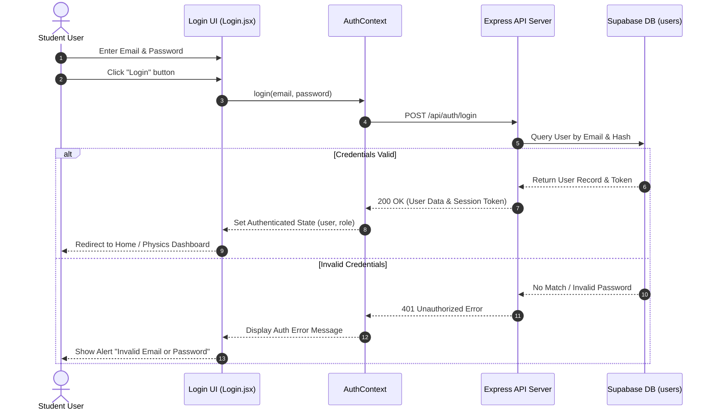
```mermaid
sequenceDiagram
    autonumber
    actor Student as Student User
    participant UI as Login UI (Login.jsx)
    participant Auth as AuthContext
    participant API as Express API Server
    participant DB as Supabase DB (users)

    Student->>UI: Enter Email & Password
    Student->>UI: Click "Login" button
    UI->>Auth: login(email, password)
    Auth->>API: POST /api/auth/login
    API->>DB: Query User by Email & Hash
    alt Credentials Valid
        DB-->>API: Return User Record & Token
        API-->>Auth: 200 OK (User Data & Session Token)
        Auth-->>UI: Set Authenticated State (user, role)
        UI-->>Student: Redirect to Home / Physics Dashboard
    else Invalid Credentials
        DB-->>API: No Match / Invalid Password
        API-->>Auth: 401 Unauthorized Error
        Auth-->>UI: Display Auth Error Message
        UI-->>Student: Show Alert "Invalid Email or Password"
    end
```

### 🔁 Sequence Diagram 2: Teacher Application & Approval Flow
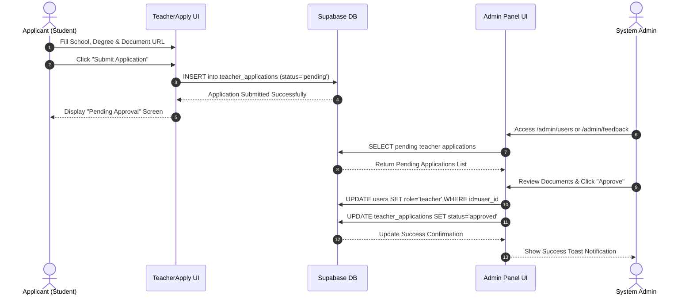
```mermaid
sequenceDiagram
    autonumber
    actor Student as Applicant (Student)
    participant AppUI as TeacherApply UI
    participant DB as Supabase DB
    participant AdminUI as Admin Panel UI
    actor Admin as System Admin

    Student->>AppUI: Fill School, Degree & Document URL
    Student->>AppUI: Click "Submit Application"
    AppUI->>DB: INSERT into teacher_applications (status='pending')
    DB-->>AppUI: Application Submitted Successfully
    AppUI-->>Student: Display "Pending Approval" Screen

    Admin->>AdminUI: Access /admin/users or /admin/feedback
    AdminUI->>DB: SELECT pending teacher applications
    DB-->>AdminUI: Return Pending Applications List
    Admin->>AdminUI: Review Documents & Click "Approve"
    AdminUI->>DB: UPDATE users SET role='teacher' WHERE id=user_id
    AdminUI->>DB: UPDATE teacher_applications SET status='approved'
    DB-->>AdminUI: Update Success Confirmation
    AdminUI-->>Admin: Show Success Toast Notification
```

### 🔁 Sequence Diagram 3: Real-Time PK Battle Matchmaking Flow
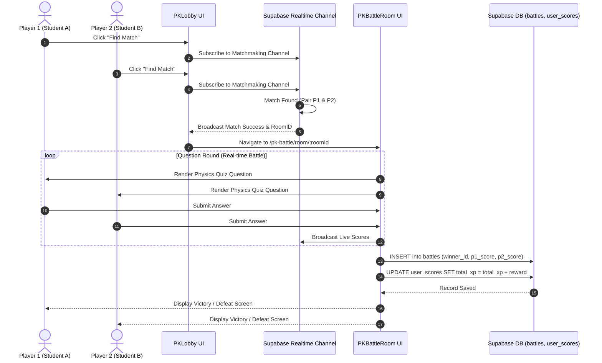
```mermaid
sequenceDiagram
    autonumber
    actor P1 as Player 1 (Student A)
    actor P2 as Player 2 (Student B)
    participant Lobby as PKLobby UI
    participant WS as Supabase Realtime Channel
    participant Room as PKBattleRoom UI
    participant DB as Supabase DB (battles, user_scores)

    P1->>Lobby: Click "Find Match"
    Lobby->>WS: Subscribe to Matchmaking Channel
    P2->>Lobby: Click "Find Match"
    Lobby->>WS: Subscribe to Matchmaking Channel
    WS->>WS: Match Found (Pair P1 & P2)
    WS-->>Lobby: Broadcast Match Success & RoomID
    Lobby->>Room: Navigate to /pk-battle/room/:roomId

    loop Question Round (Real-time Battle)
        Room->>P1: Render Physics Quiz Question
        Room->>P2: Render Physics Quiz Question
        P1->>Room: Submit Answer
        P2->>Room: Submit Answer
        Room->>WS: Broadcast Live Scores
    end

    Room->>DB: INSERT into battles (winner_id, p1_score, p2_score)
    Room->>DB: UPDATE user_scores SET total_xp = total_xp + reward
    DB-->>Room: Record Saved
    Room-->>P1: Display Victory / Defeat Screen
    Room-->>P2: Display Victory / Defeat Screen
```

### 🔁 Sequence Diagram 4: Real-Time Support Chat Flow
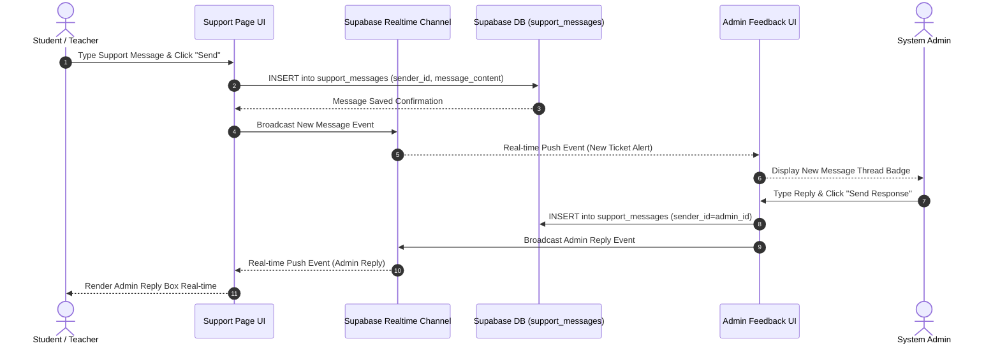
```mermaid
sequenceDiagram
    autonumber
    actor User as Student / Teacher
    participant SupportUI as Support Page UI
    participant Channel as Supabase Realtime Channel
    participant DB as Supabase DB (support_messages)
    participant AdminUI as Admin Feedback UI
    actor Admin as System Admin

    User->>SupportUI: Type Support Message & Click "Send"
    SupportUI->>DB: INSERT into support_messages (sender_id, message_content)
    DB-->>SupportUI: Message Saved Confirmation
    SupportUI->>Channel: Broadcast New Message Event

    Channel-->>AdminUI: Real-time Push Event (New Ticket Alert)
    AdminUI-->>Admin: Display New Message Thread Badge
    Admin->>AdminUI: Type Reply & Click "Send Response"
    AdminUI->>DB: INSERT into support_messages (sender_id=admin_id)
    AdminUI->>Channel: Broadcast Admin Reply Event
    Channel-->>SupportUI: Real-time Push Event (Admin Reply)
    SupportUI-->>User: Render Admin Reply Box Real-time
```

---

## 6. Sơ đồ Trạng thái (State Machine Diagrams cho Toàn bộ Hệ thống)

### 🔄 State Machine Diagram 1: Teacher Application Lifecycle
**Figure 3.13: State Machine Diagram - Teacher Application Lifecycle**
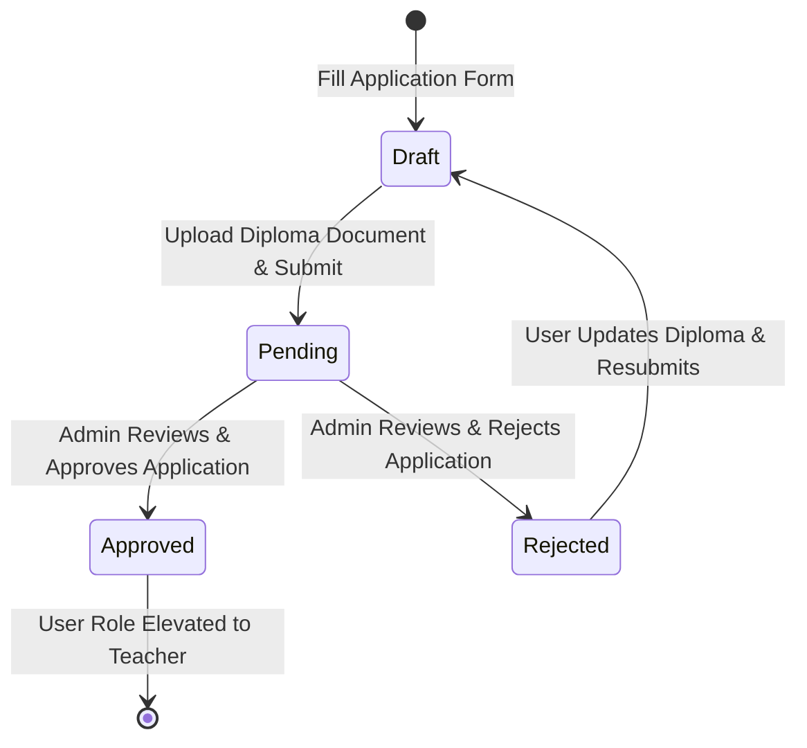
```mermaid
stateDiagram-v2
    [*] --> Draft: Fill Application Form
    Draft --> Pending: Upload Diploma Document & Submit
    Pending --> Approved: Admin Reviews & Approves Application
    Pending --> Rejected: Admin Reviews & Rejects Application
    Approved --> [*]: User Role Elevated to Teacher
    Rejected --> Draft: User Updates Diploma & Resubmits
```

---

### 🔄 State Machine Diagram 2: PK Battle Arena Lifecycle
**Figure 3.14: State Machine Diagram - PK Battle Arena Lifecycle**
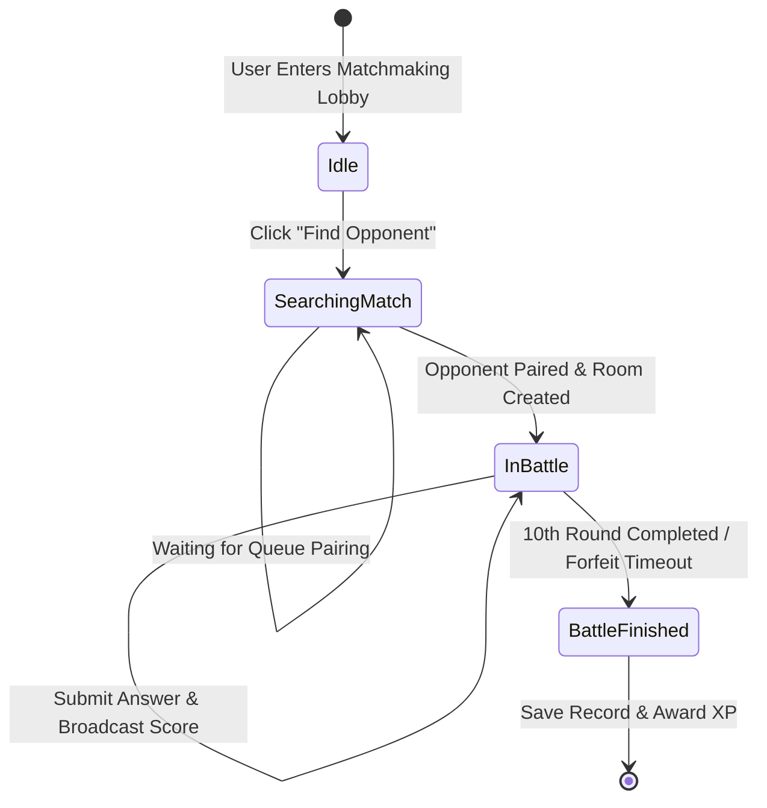
```mermaid
stateDiagram-v2
    [*] --> Idle: User Enters Matchmaking Lobby
    Idle --> SearchingMatch: Click "Find Opponent"
    SearchingMatch --> SearchingMatch: Waiting for Queue Pairing
    SearchingMatch --> InBattle: Opponent Paired & Room Created
    InBattle --> InBattle: Submit Answer & Broadcast Score
    InBattle --> BattleFinished: 10th Round Completed / Forfeit Timeout
    BattleFinished --> [*]: Save Record & Award XP
```

---

### 🔄 State Machine Diagram 3: System Maintenance Mode Lifecycle
**Figure 3.15: State Machine Diagram - System Maintenance Mode Lifecycle**
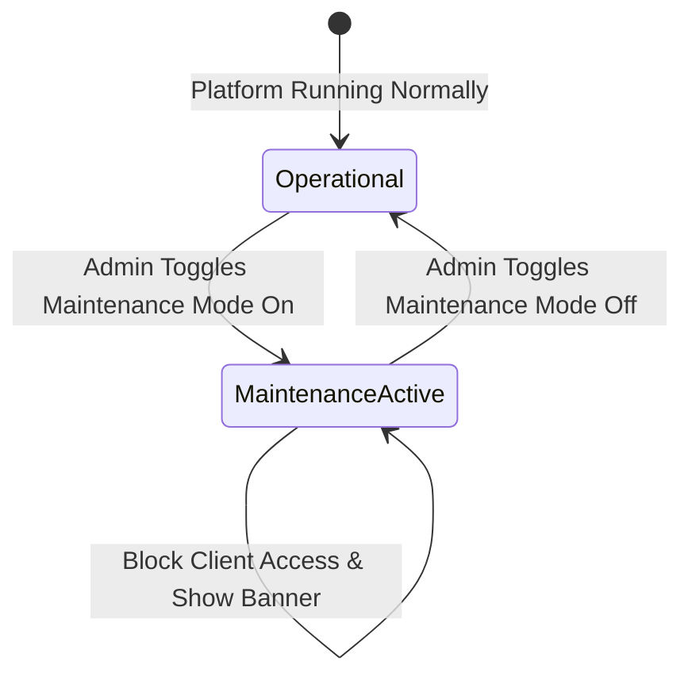
```mermaid
stateDiagram-v2
    [*] --> Operational: Platform Running Normally
    Operational --> MaintenanceActive: Admin Toggles Maintenance Mode On
    MaintenanceActive --> MaintenanceActive: Block Client Access & Show Banner
    MaintenanceActive --> Operational: Admin Toggles Maintenance Mode Off
```

---

### 🔄 Auxiliary State Machine 1: User Account Status Lifecycle
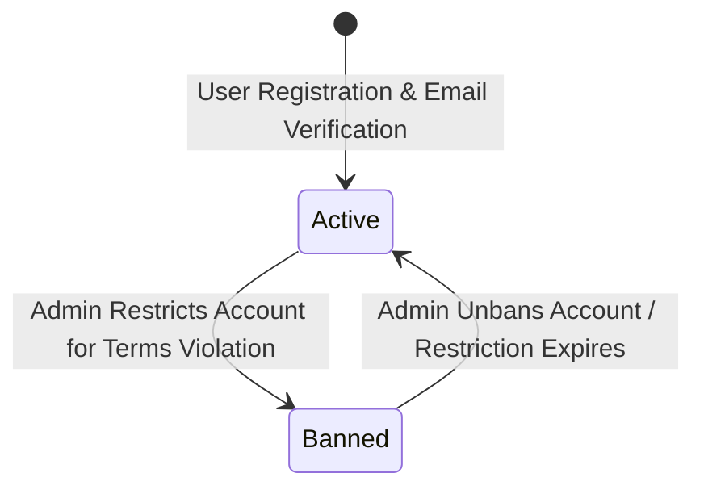
```mermaid
stateDiagram-v2
    [*] --> Active: User Registration & Email Verification
    Active --> Banned: Admin Restricts Account for Terms Violation
    Banned --> Active: Admin Unbans Account / Restriction Expires
```

---

### 🔄 Auxiliary State Machine 2: Lesson Progress Lifecycle
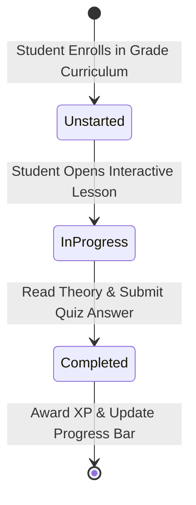
```mermaid
stateDiagram-v2
    [*] --> Unstarted: Student Enrolls in Grade Curriculum
    Unstarted --> InProgress: Student Opens Interactive Lesson
    InProgress --> Completed: Read Theory & Submit Quiz Answer
    Completed --> [*]: Award XP & Update Progress Bar
```

---

### 🔄 Auxiliary State Machine 3: Placement Assessment Test Lifecycle
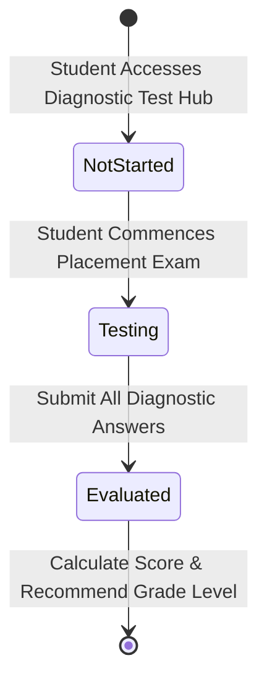
```mermaid
stateDiagram-v2
    [*] --> NotStarted: Student Accesses Diagnostic Test Hub
    NotStarted --> Testing: Student Commences Placement Exam
    Testing --> Evaluated: Submit All Diagnostic Answers
    Evaluated --> [*]: Calculate Score & Recommend Grade Level
```

---

### 🔄 Auxiliary State Machine 4: Real-Time Support Ticket Lifecycle
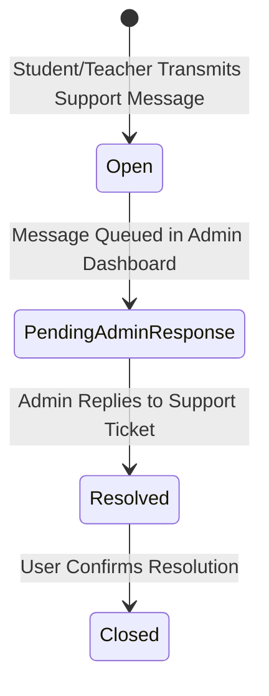
```mermaid
stateDiagram-v2
    [*] --> Open: Student/Teacher Transmits Support Message
    Open --> PendingAdminResponse: Message Queued in Admin Dashboard
    PendingAdminResponse --> Resolved: Admin Replies to Support Ticket
    Resolved --> Closed: User Confirms Resolution
```

---

### 🔄 Auxiliary State Machine 5: Virtual Physics Lab Session Lifecycle
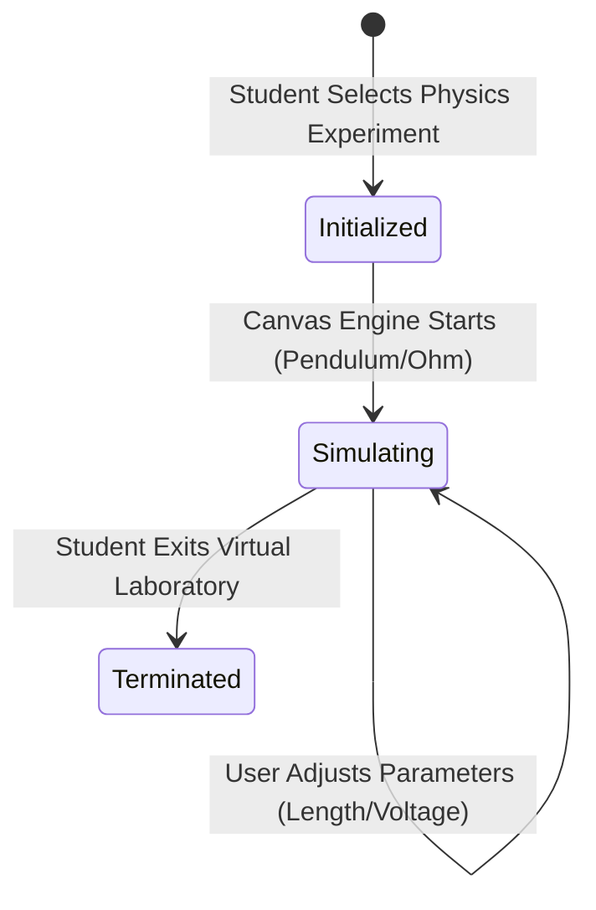
```mermaid
stateDiagram-v2
    [*] --> Initialized: Student Selects Physics Experiment
    Initialized --> Simulating: Canvas Engine Starts (Pendulum/Ohm)
    Simulating --> Simulating: User Adjusts Parameters (Length/Voltage)
    Simulating --> Terminated: Student Exits Virtual Laboratory
```

---

# CHƯƠNG 4: THIẾT KẾ HẠ TẦNG TRIỂN KHAI PRODUCTION

## 7. Sơ đồ Hạ tầng Triển khai Production (Production Deployment Infrastructure Diagram)
**Figure 4.1: Production Deployment Infrastructure Diagram (Client Devices, Vercel Serverless, Supabase Cloud)**

```mermaid
graph TB
    subgraph Client_Layer ["1. CLIENT ACCESS LAYER (User Viewports)"]
        Desktop["Desktop Browsers<br/>(Chrome, Firefox, Edge, Safari)"]
        Mobile["Mobile & Tablet Browsers<br/>(iOS Safari, Android Chrome)"]
    end

    subgraph Hosting_Layer ["2. VERCEL CLOUD EDGE INFRASTRUCTURE"]
        CDN["Vercel Global Edge CDN<br/>(Static React 18 SPA Delivery)"]
        ServerlessFunc["Vercel Serverless Functions<br/>(Node.js / Express.js REST API Server)"]
    end

    subgraph BaaS_Layer ["3. SUPABASE CLOUD BACKEND (BaaS)"]
        AuthGateway["Supabase Authentication Service<br/>(JWT Identity & Session Tokens)"]
        PostgresDB[("Supabase Managed PostgreSQL 15<br/>(Relational Database Storage)")]
        RealtimeSockets["Supabase Realtime WebSockets Engine<br/>(Sub-150ms PK Arena & Chat Sync)"]
        ObjectStorage["Supabase Storage Buckets<br/>(Teacher Diplomas & Profile Avatars)"]
    end

    Desktop --> CDN
    Mobile --> CDN

    CDN --> ServerlessFunc
    CDN --> RealtimeSockets

    ServerlessFunc --> AuthGateway
    ServerlessFunc --> PostgresDB
    ServerlessFunc --> ObjectStorage

    RealtimeSockets <--> Desktop
    RealtimeSockets <--> Mobile
```

---

# CHƯƠNG 2: KIẾN TRÚC HẠ TẦNG ĐÁM MÂY SUPABASE BAAS

## 8. Sơ đồ Kiến trúc Hạ tầng Đám mây Supabase BaaS (Section 2.2.4)
**Figure 2.4: Supabase Cloud BaaS Component Architecture Diagram**

```mermaid
graph TB
    subgraph Client_App ["Client Application (React 18 SPA)"]
        AuthSDK["Supabase Auth Client SDK"]
        RESTClient["Axios / Fetch API Client"]
        RealtimeSDK["Supabase Realtime Client"]
        StorageSDK["Supabase Storage Client SDK"]
    end

    subgraph Supabase_Cloud ["SUPABASE CLOUD BAAS INFRASTRUCTURE"]
        subgraph Auth_Service ["1. Authentication Gateway"]
            GoTrue["GoTrue Auth Server"]
            JWTEngine["JWT Token & Bcrypt Hashing Engine"]
        end

        subgraph Database_Service ["2. Relational Database Layer"]
            PostgreSQL[("Managed PostgreSQL 15 Engine")]
            RLSPolicies["Row Level Security (RLS) Policies"]
        end

        subgraph Realtime_Service ["3. Real-Time Communications"]
            PhoenixEngine["Realtime Engine (WebSockets)"]
            PubSubChannels["Pub/Sub Channels (PK Arena & Chat)"]
        end

        subgraph Storage_Service ["4. Object Storage Infrastructure"]
            S3Buckets["S3-Compatible Object Storage"]
            CDNEdge["Storage CDN Public / Private Buckets"]
        end
    end

    AuthSDK <-->|Auth Tokens / Passwords| GoTrue
    GoTrue --> JWTEngine

    RESTClient <-->|REST API Queries| PostgreSQL
    PostgreSQL --- RLSPolicies

    RealtimeSDK <-->|WSS WebSockets| PhoenixEngine
    PhoenixEngine --- PubSubChannels

    StorageSDK <-->|Upload / Fetch Assets| S3Buckets
    S3Buckets --- CDNEdge
```
